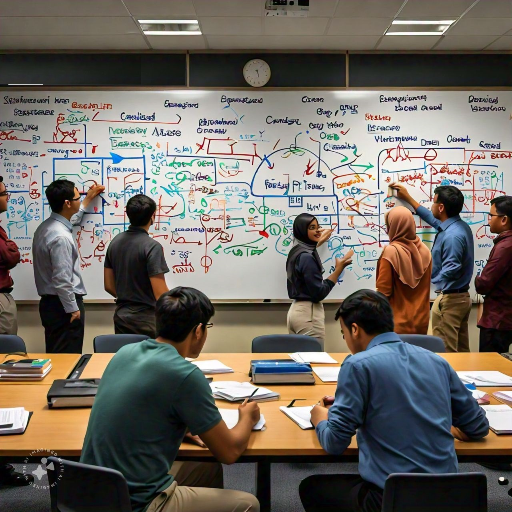

# Finding feasible solutions of Examination Timetabling Problem using Genetic Algorithm

This project was done during my internship in Mahindra University, Hyderabad under the mentorship of Dr. Rakesh Prasad Badoni.
 ## Problem Statement
 
 ```
 The problem is to create am optmized timetable using given data under the following costraints:

 Hard Constraints [All of them should be satisfied in a feasible timetable]
1. No student should have overlapping exams
2. Room capacity must not exceed
3. Rooms must have the required facilities

Soft Constraints
1. Minimize the proximity of exams given by a student
2. Schedule exam during preferred times and rooms
 ```

## Data Format
The original data used is taken from "Benchmark Data Sets in Exam Timetabling." Retrieved from [http://www.cs.nott.ac.uk/~pszrq/data.htm](http://www.cs.nott.ac.uk/~pszrq/data.htm). Accessed on 13 June 2024.
The raw data is given in the folder  `data/RAW`, each instance has two files - course data and student data
- files ending in `.crs` has details of how many students are enrolled in each course.
- files ending in `.stu` has list of courses enrolled by each student.

To accommodate the specific problem, some data was randomly generated and incorporated with this dataset in each dataset and converted to `csv` format. The python file `scripts/data_generator.py` is used for the random generation.
In each of the folders in `data` other than `RAW` there are 7 files
- `course_data` the number of students along with randomly generated boolean values of required facilities
- `dates` are the dates available for exams and t-day represents the distance from starting date
- `datetime_preference` is a boolean matrix that represents the preference among students and teachers in conducting an exam in a specific date and time. 5 meaning highly preferred and 1 means least preferred
- `room_data` has the list of rooms available for exams with their capacities and the facilities avaialable
- `room_preference` is a boolean matrix that represents the preference among students and teachers in conducting an exam in a specific room. 5 meaning highly preferred and 1 means least preferred while 0 means the exam cannot be conducted in that room, either due to unavailable facilities or not enough capacity.
- `student_data` has list of courses enrolled by each student.
- `times` is a list of available timeslot, in this case only 2 timeslots are available in every day : 10AM and 2PM
## Implementation
Two classes were created for structuring the code properly:
### Instance class
- Represents each instance of datasets
- When an instance is created with the instance name, data from all csv files are read and saved to variables properly
- A `c_r_feasible` matrix is created that represents what 

## Solution Methodology

This project primarly focuses on genetic algorithm, although to create initial population for genetic algorithm a graph theory algorithm as mentioned in John E. L. Peck and Michael R. Williams. (1966). "Algorithm 286: Examination scheduling." *Communications of the ACM, 9*, 433-434. Retrieved from [https://api.semanticscholar.org/CorpusID:20123677](https://api.semanticscholar.org/CorpusID:20123677) is used.
```
1. A feasible population is created using the `Algorithm 286`.
2. A random (probably infeasible) population is created.
3. Initial population is both the feasible and infeasible populations together
4. In `Genetic Algorithm`, for each generation:
   1. A mating pool is selected in random usign `tournament selection`
   2. Each alternate parent in mating pool is `cross over`ed with the adjacent parent with a given crossover probability
      1. A random cross over point is selected 
      2. Both, room_assignment list and date_assignment list of parents are split at that point
      3. first part of parent1 is joined with 2nd part of parent2 and vice versa
      4. Return the two offsprings
   3. The the cross overed offsprings are `mutate`d with a given mutation probability
      1. For each date_assignment list and room_assignment list, a random boolean mask is created
      2. If the boolean mask is 1 at some index then the assignment corresponding to that index will be changed randomly
   4. After creating the new generation of offsprings, the offspring with least soft constraint violation is repaired if it is not feasible
      1. Among the feasible populations of previous generation, the solution closest to this is chosen (Euclidean distance)
      2. For each assignment that causes infeasiblity, the assignment according to the closest feasible solution is given **recursively**
   5. The population containing repaired and irrepaired offsprings are combined and sorted according to the penalty violation (hard penaly violation has more weightage)
   6. From the combined population a fixed number of offsprings are selected from top and are passed out to the next generation
```